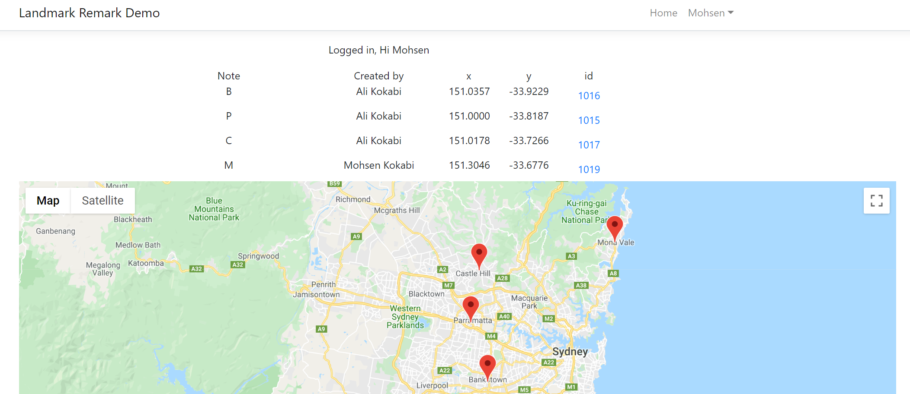
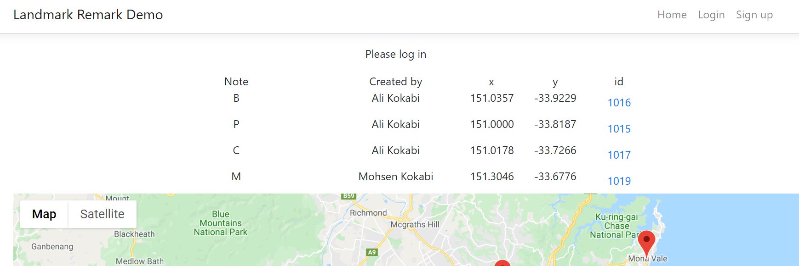
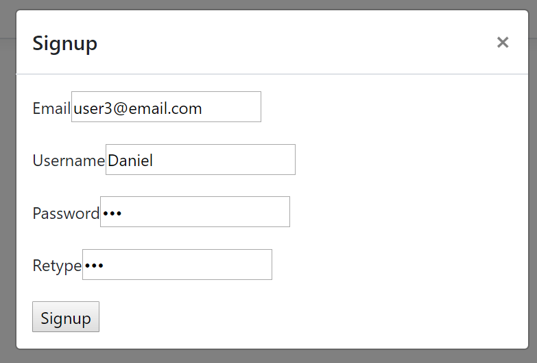
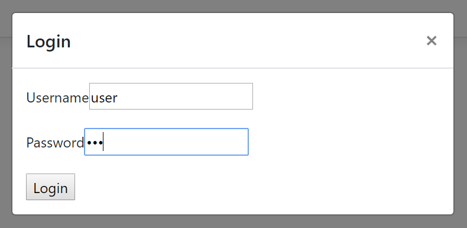
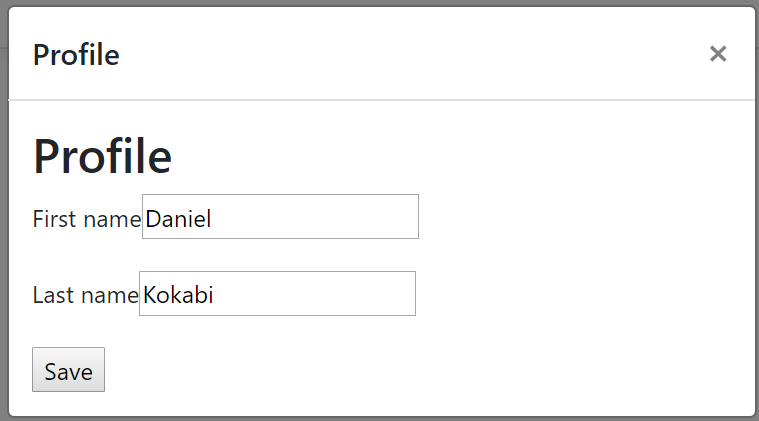
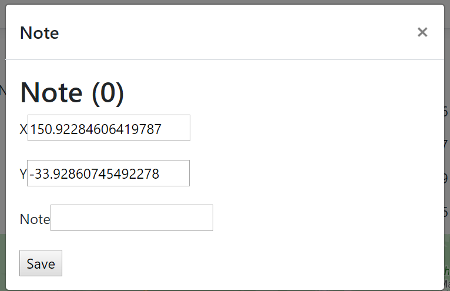

# Landmark Remark

## Goal
allows users to save location based notes on a map.
These notes can be  displayed on the map where they were saved and 
viewed by the user that  created the note as well as other users 
of the application. 

## User stories

1. As a user (of the application) I can see my current location on a map  
2. As a user I can save a short note at my current location  
3. As a user I can see notes that I have saved at the location they were saved  on the map  
4. As a user I can see the location, text, and user-name of notes other users  have saved  
5. As a user I have the ability to search for a note based on contained text or  user-name  

## Backlog
[Online available in DevOps](https://mohsenapp.visualstudio.com/Tigerspike/_workitems/recentlyupdated/)

## Design
### Front-end 
A thin front-end using React and Google map api

### Back-end
Dot net core 3.0 Rest API with Entity frameword

### Database
SQL Server


## Deployment

### Database
Creating initial migration
```
\Tigerspike.LandmarkRemark\Api>dotnet ef migrations add Initial
```
Deploying the database
```
\Tigerspike.LandmarkRemark\Api>dotnet ef database update
```

## User stories

### Default look
Logged in


Not Logged in



### Registration
User can start using the application by registration.
This step only need email, username and password. 
Password should be entered twice.



### Login
Login is the starting point for the existing users.



### Update profile
Existing users can update their profile. 
Currently the only fields here are username and password.



### Taking note
Logged in users cantake note by clicking on the map.
It will open a popup where user can enter a note.



### Logout
It would clear the local storage. 


